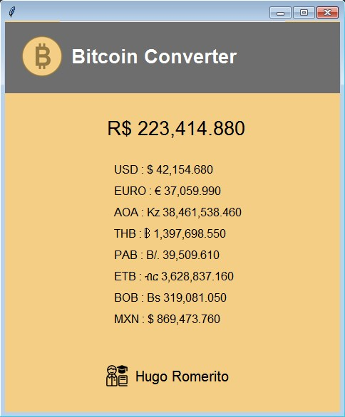

 
 ​<h1 align="center"> 
 ​  🪙 Bitcoin Converter 
 ​</h1> 
  
 ​<h4 align="center"> 
 ​  Programa de cotação do Bitcoin 
 ​</h4> 
  
 ​ 

## 📚 Função
O Bitcoin Converter exibe em tempo real sua cotação nas seguintes moedas:

- **BRL** Real brasileiro;
- **USD:** Dolar americano;
- **EURO:** Moeda da União Europeia;

---
 
## 🧬 Tecnologias utilizadas
Tecnologias utilizadas na construção do app:

- **Python;**

---

## Versão Atual

- **Version 1.0**

---

## 👨‍💻 Autor 
<table>
  <tr>
    <td align="center">
      <a href="https://github.com/hugoromerito">
         
        
          <b>Hugo Romerito</b>
        
      </a>
    </td>
  </tr>
</table>
